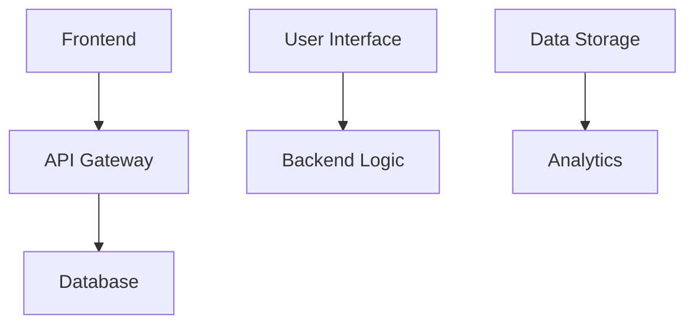

# Project Overview

## Project Title and Concise Description
This project is a comprehensive web application designed to provide users with detailed information about various tourist destinations. It includes features such as interactive maps, user reviews, and personalized travel recommendations.

## Purpose and Main Functionality
The primary purpose of this project is to offer an engaging and informative platform for tourists planning their trips. The main functionality includes displaying destination details, managing user accounts, and facilitating communication between users through a review system.

## Key Features and Capabilities
- Interactive maps with markers for tourist attractions
- User authentication and profile management
- Real-time reviews and ratings from other users
- Personalized travel recommendations based on user preferences

## Likely Intended Use Cases
- Tourists looking to plan their trips
- Travel agencies seeking to promote destinations
- Local businesses wanting to manage their online presence

# Table of Contents
1. [Architecture](#architecture)
2. [C4 Model Architecture](#c4-model-architecture)
3. [Repository Structure](#repository-structure)
4. [Dependencies and Integration](#dependencies-and-integration)
5. [API Documentation](#api-documentation)
6. [Development Notes](#development-notes)
7. [Known Issues and Limitations](#known-issues-and-limitations)
8. [Additional Documentation](#additional-documentation)

# Architecture
## High-Level Architecture Overview
The architecture of this project is designed to be modular, scalable, and maintainable. It consists of several key components that work together to provide a seamless user experience.

## Technology Stack and Frameworks
- Frontend: React.js with Material-UI for UI components
- Backend: Node.js with Express.js for server-side logic
- Database: MongoDB for storing user data, reviews, and destinations
- Hosting: AWS Elastic Beanstalk for deployment

## Component Relationships (with mermaid diagrams)


## Key Design Patterns
- MVC (Model-View-Controller) for separating concerns in the frontend
- RESTful API design for backend services

# C4 Model Architecture
## Context Diagram: System and Its Relationships
```mermaid
diagram
    title Context Diagram
    participant User
    participant Frontend
    participant Backend
    participant Database
    participant Analytics
    User -> Frontend
    Frontend -> Backend
    Backend -> Database
    Backend -> Analytics
```

## Container Diagram: High-Level Technical Building Blocks
```mermaid
diagram
    title Container Diagram
    classDef frontend fill:#FF6B6B,stroke:#000,stroke-width:2px;
    classDef backend fill:#3498DB,stroke:#000,stroke-width:2px;
    classDef database fill:#F1C40F,stroke:#000,stroke-width:2px;
    classDef analytics fill:#E74C3C,stroke:#000,stroke-width:2px;

    frontend --> backend
    backend --> database
    backend --> analytics
```

# Repository Structure
## Important Directories and Their Purposes
- `src/`: Contains the source code for both frontend and backend components.
- `public/`: Stores static assets like images, stylesheets, etc.
- `config/`: Holds configuration files for environment variables, database connections, etc.
- `tests/`: Includes unit tests and integration tests to ensure functionality.

## Key Files and Their Roles
- `index.js`: Entry point for the application.
- `app.js`: Main server file for backend logic.
- `routes/`: Directory containing API routes and handlers.
- `models/`: Contains database schema definitions.

# Dependencies and Integration
## Internal and External Service Dependencies
The project relies on several internal services such as user authentication, review management, and destination data storage. Additionally, it integrates with external APIs for weather updates and map services to enhance the user experience.

# API Documentation
## API Endpoints
- `/api/destinations`: Fetches a list of destinations.
- `/api/reviews`: Submits or retrieves reviews for a specific destination.

## Request/Response Formats
```json
// Example request body for submitting a review
{
  "destination_id": "123",
  "rating": 5,
  "comment": "Great place!"
}
```

# Development Notes
## Project-Specific Conventions
- Follow PEP8 guidelines for Python code.
- Use ESLint and Prettier for JavaScript/TypeScript linting and formatting.

## Testing Requirements
- Write unit tests for all new features.
- Perform integration testing to ensure components work together seamlessly.

## Performance Considerations
- Optimize database queries to reduce latency.
- Implement caching strategies for frequently accessed data.

# Known Issues and Limitations
## TODOs and FIXMEs
- Improve error handling in the API endpoints.
- Add more detailed validation checks for user inputs.

## Incomplete Features or Technical Debt
- Enhance the recommendation system to provide better personalized suggestions.
- Implement a more robust logging mechanism for debugging purposes.

# Additional Documentation
## Links to Other Repository Documentation
- [Code Style Guide](./code_style_guide.md)
- [Deployment Instructions](./deployment_instructions.md)
