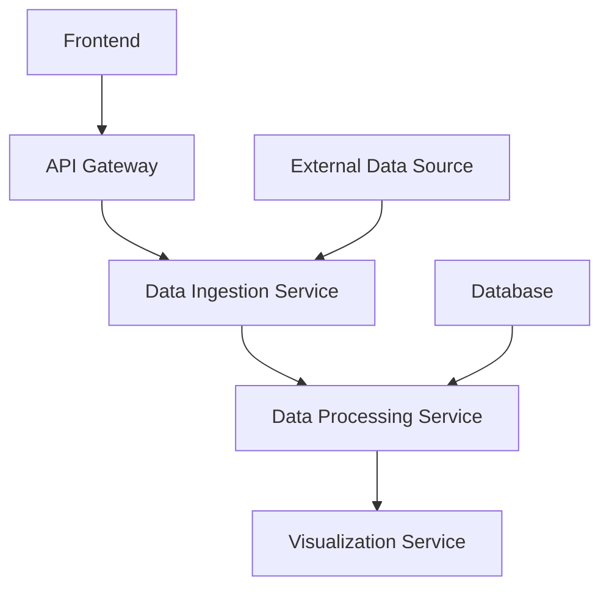

# Web Development Project

## Project Overview

### Project Title and Concise Description
This project is a web application designed to provide users with real-time data analysis capabilities. It leverages modern web technologies for an interactive user experience.

### Purpose and Main Functionality
The primary purpose of this project is to enable users to input datasets, perform various analyses, and visualize the results in a dynamic manner. The main functionality includes data ingestion, processing, and visualization through a RESTful API.

### Key Features and Capabilities
- Real-time data analysis
- Interactive dashboard for visualizing results
- Support for multiple data formats (CSV, JSON)
- Scalable backend infrastructure

### Likely Intended Use Cases
- Data scientists looking to perform quick analyses on large datasets
- Researchers needing real-time data processing capabilities
- Developers interested in building custom dashboards and reports

## Table of Contents
1. [Architecture](#architecture)
2. [C4 Model Architecture](#c4-model-architecture)
3. [Repository Structure](#repository-structure)
4. [Dependencies and Integration](#dependencies-and-integration)
5. [API Documentation](#api-documentation)
6. [Development Notes](#development-notes)
7. [Known Issues and Limitations](#known-issues-and-limitations)
8. [Additional Documentation](#additional-documentation)

## Architecture

### High-Level Architecture Overview
The project is built using a microservices architecture, with each service handling specific functionalities such as data ingestion, processing, and visualization.

### Technology Stack and Frameworks
- Frontend: React.js
- Backend: Node.js with Express
- Database: PostgreSQL
- Data Processing: Pandas (Python)
- Visualization: Plotly.js

### Component Relationships (with mermaid diagrams)


### Key Design Patterns
- Microservices architecture for scalability and modularity
- Event-driven processing to handle real-time data streams
- RESTful API design for easy integration with other systems

## C4 Model Architecture

### Context Diagram: System and Its Relationships
```mermaid
diagram TD;
    A[Web Application] --> B[User]
    A --> C[System Interface]
    C --> D[Backend Services]
    D --> E[Database]
```

### Container Diagram: High-Level Technical Building Blocks
```mermaid
diagram TD;
    A[Frontend] --> B[API Gateway]
    B --> C[Data Ingestion Service]
    C --> D[Data Processing Service]
    D --> E[Visualization Service]
    F[Database] --> D
    G[External Data Source] --> C
```

## Repository Structure

### Important Directories and Their Purposes
- `src/`: Contains the source code for the project.
  - `frontend/`: React.js frontend application.
  - `backend/`: Node.js backend services.
  - `data/`: Raw data files and scripts for processing.
  - `public/`: Static assets like images, CSS, etc.

### Key Files and Their Roles
- `.env`: Environment variables configuration file.
- `package.json`: Project dependencies and scripts.
- `README.md`: This document itself.

## Dependencies and Integration

### Internal and External Service Dependencies
- Internal services: Data Ingestion, Processing, Visualization
- External service: PostgreSQL database

### Event Streams or Message Queues (if applicable)
- Not currently in use but could be integrated for real-time data updates

## API Documentation

### API Endpoints
- `/api/v1/upload`: Uploads a dataset and returns an identifier.
- `/api/v1/analyze/{identifier}`: Analyzes the uploaded dataset and returns results.
- `/api/v1/visualize/{identifier}`: Generates visualizations based on analysis results.

### Request/Response Formats
- **Upload**: POST /api/v1/upload
  - Body: {"file": "path/to/file.csv"}
- **Analyze**: GET /api/v1/analyze/{identifier}
  - Response: {"results": ["result1", "result2"]}
- **Visualize**: GET /api/v1/visualize/{identifier}
  - Response: HTML content with embedded visualizations

## Development Notes

### Project-Specific Conventions
- Follow PEP8 for Python code.
- Use ESLint and Prettier for JavaScript.
- Commit messages should follow the conventional commit format.

### Testing Requirements
- Unit tests for backend services using Jest.
- Integration tests for frontend components using React Testing Library.
- End-to-end tests using Cypress.

### Performance Considerations
- Optimize database queries to reduce latency.
- Implement caching strategies for frequently accessed data.

## Known Issues and Limitations

### TODOs and FIXMEs
- Add more unit tests for edge cases in the backend services.
- Improve error handling in the frontend.

### Incomplete Features or Technical Debt
- Real-time updates via websockets are not yet implemented.
- Some data processing functions could be optimized further.

## Additional Documentation

### Links to Other Repository Documentation
- [Code Analysis](#)
- [Data Flow Analysis](#)
- [Dependency Analysis](#)
- [Request Flow Analysis](#)
